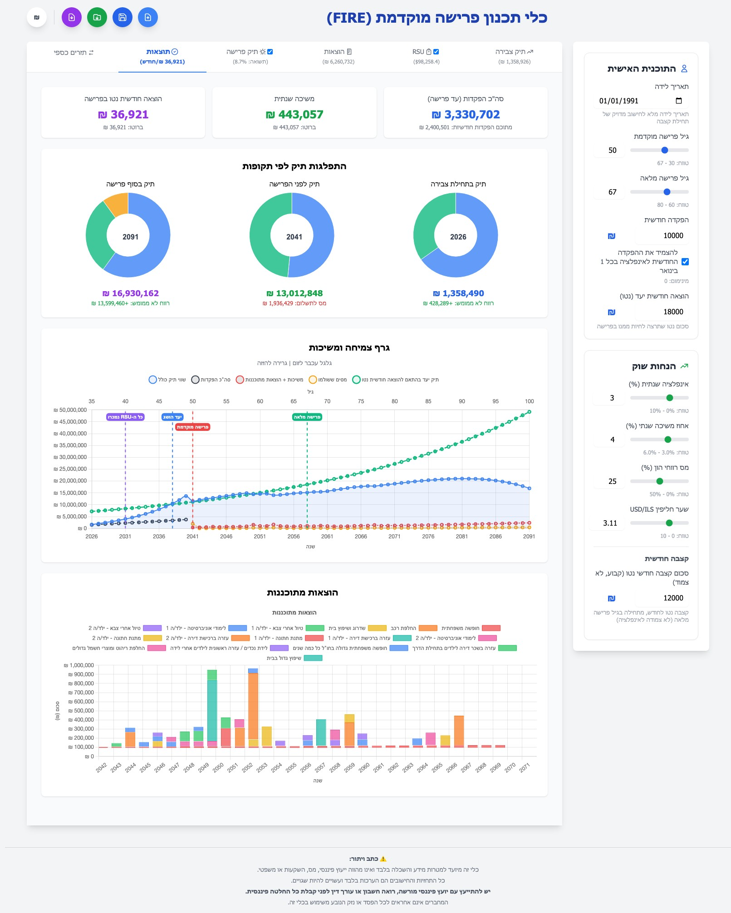
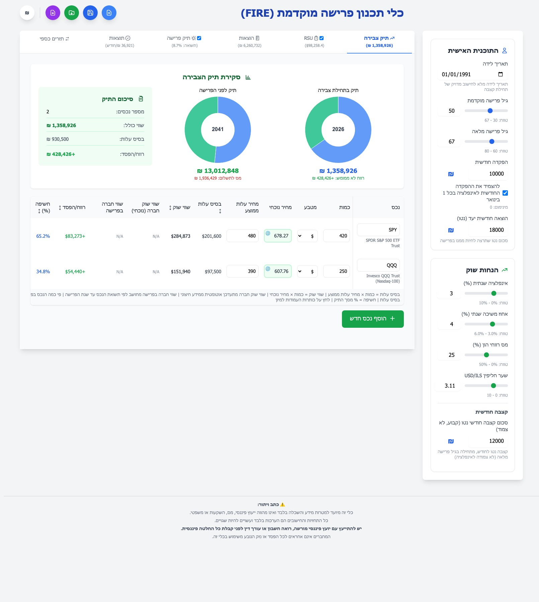
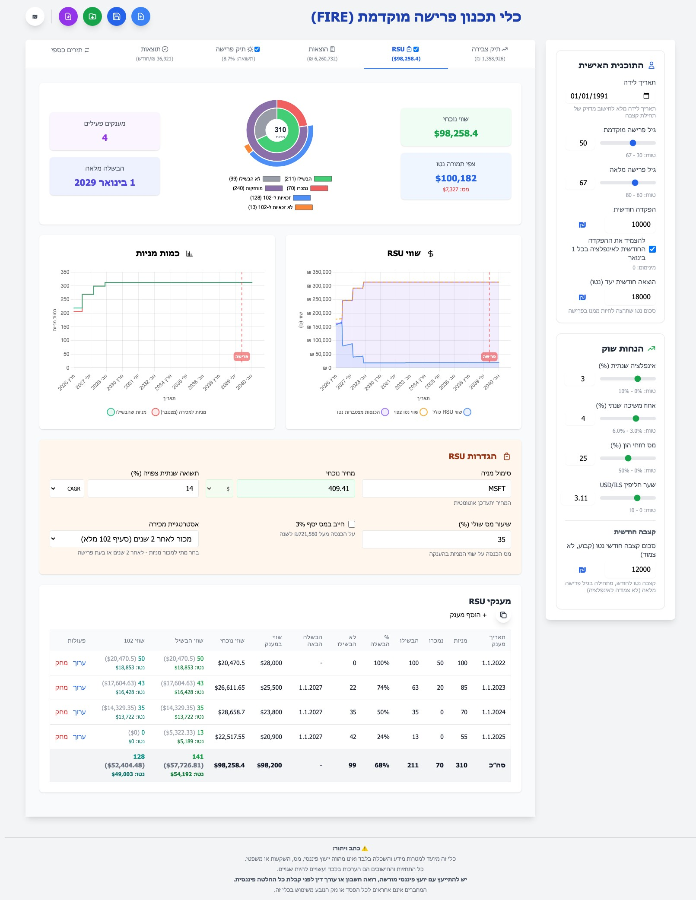
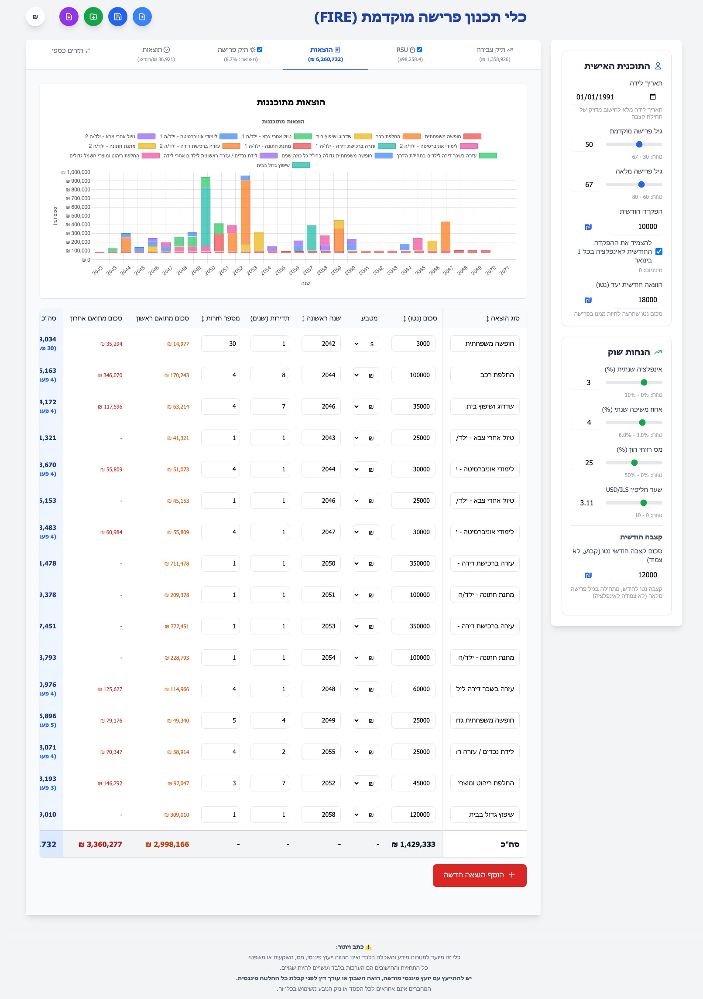
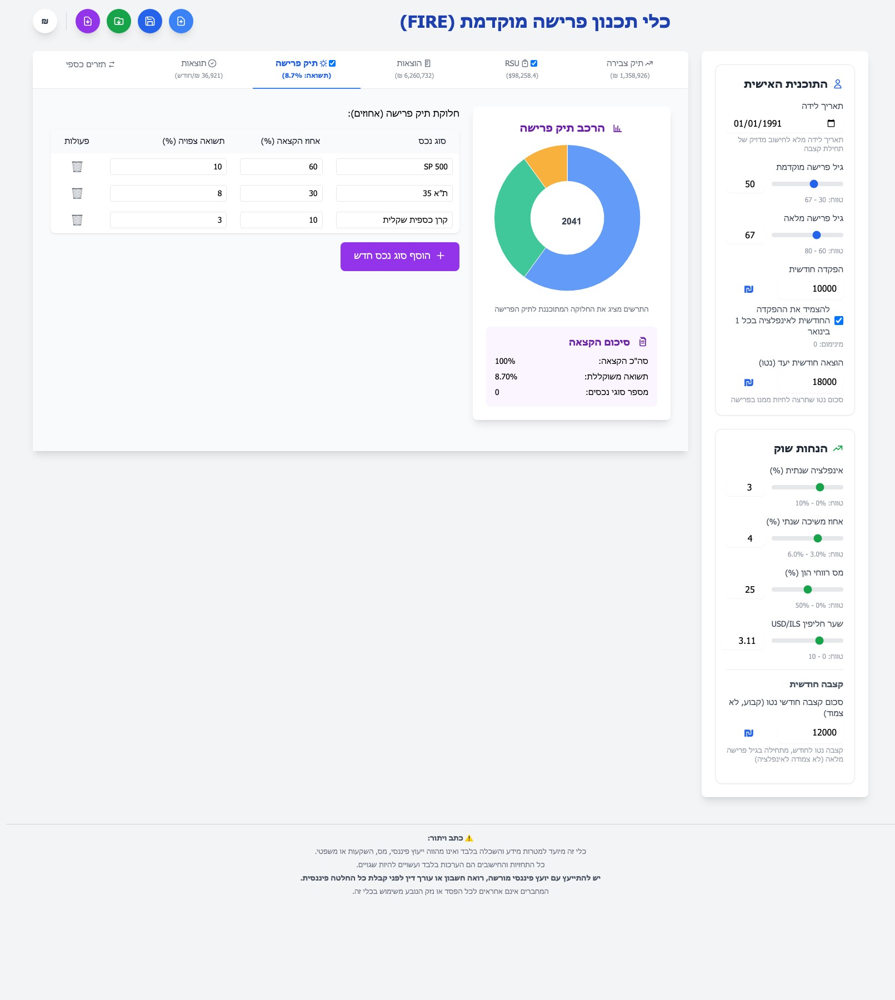
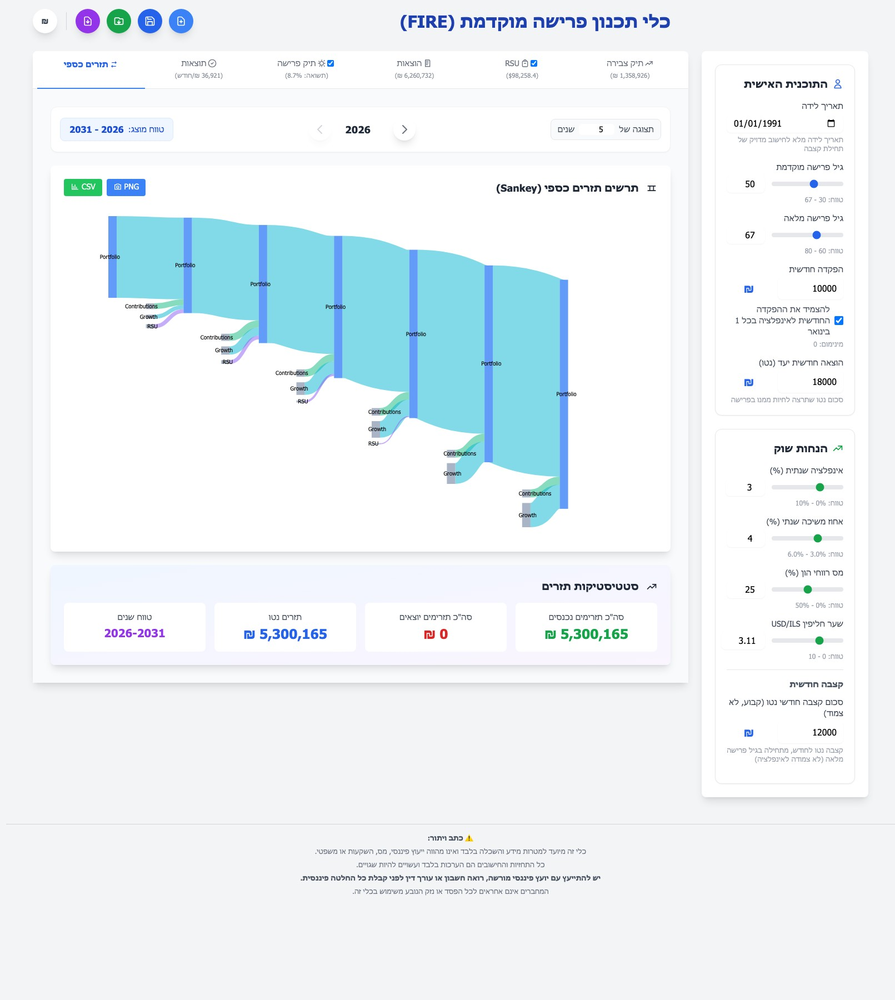

# FIRE Planning Tool - כלי תכנון פרישה מוקדמת

[](https://github.com/Ariel-B/fire/actions/workflows/tests.yml)
[](LICENSE)

> **Achieve Financial Independence, Retire Early** 🔥

A comprehensive C# ASP.NET Core web application for FIRE (Financial Independence, Retire Early) planning with Hebrew RTL interface and portfolio simulation.



> **⚠️ Disclaimer:** This tool is provided for **informational and educational purposes only**. It does not constitute financial, tax, investment, or legal advice. All projections and calculations are estimates based on the inputs you provide and assumptions built into the model — they may be inaccurate and should not be relied upon for actual financial decisions. Past market performance does not guarantee future results. Tax laws and regulations vary by jurisdiction and change over time. **Always consult a licensed financial advisor, tax professional, or attorney before making any financial decisions.** The authors and contributors of this project accept no liability for any loss, damage, or financial outcome resulting from reliance on this tool.

## Features

- 📊 **Portfolio Simulation** - Model your investment portfolio over time with real market data for stocks, ETFs, bonds, and other securities
- 💰 **FIRE Calculations** - Calculate your exact path to financial independence with partial-year accuracy
- 🎯 **Target Portfolio Calculator** - See the portfolio value needed to achieve your target monthly expense
- 🧮 **Tax Planning** - Account for capital gains tax in your projections
- � **Live Exchange Rates** - Automatic USD/ILS currency conversion using real-time exchange rates from external APIs
- �💾 **Save/Load Plans** - Export and import your financial plans as JSON files
- 📱 **Responsive Design** - Works seamlessly on desktop and mobile devices
- 🌍 **Hebrew RTL Support** - Complete right-to-left interface with Hebrew language
- 📈 **Interactive Charts** - Real-time visualization of portfolio growth and projections
- ⚡ **Real-time Calculations** - Instant updates as you modify any parameter
- 🏥 **Health Checks** - Built-in health monitoring for Kubernetes/Docker deployments
- 📅 **Partial-Year Calculations** - Accurate inflation and return calculations based on current date

## Technical Stack

- **Backend**: C# ASP.NET Core 9.0 Web API
- **Frontend**: TypeScript/ES6 modules, HTML5, Tailwind CSS, Chart.js
- **Language**: Hebrew (RTL layout support)
- **Testing**: xUnit (backend), Jest (frontend)
- **Charts**: Chart.js for interactive visualizations
- **External APIs**: 
  - Finnhub for real-time asset prices (stocks, ETFs, bonds, etc.)
  - exchangerate.host & Frankfurter API for live USD/ILS currency exchange rates
- **Build Tools**: TypeScript compiler, npm

## Project Structure

```
fire/
├── src/                              # Backend C# source code
│   ├── Controllers/
│   │   ├── FirePlanController.cs     # Main API endpoints for FIRE calculations
│   │   ├── AssetPricesController.cs  # Asset price API integration (stocks, ETFs, bonds)
│   │   └── ExchangeRateController.cs # Exchange rate API endpoints
│   ├── Models/
│   │   └── FirePlanModels.cs         # Data models for FIRE planning
│   ├── Services/
│   │   ├── FireCalculator.cs         # Core FIRE calculation engine
│   │   ├── FinnhubService.cs         # Finnhub API integration for asset prices
│   │   ├── ExchangeRateService.cs    # Live USD/ILS exchange rate fetching
│   │   ├── PortfolioCalculator.cs    # Portfolio value calculations
│   │   └── CurrencyConverter.cs      # USD/ILS currency conversion
│   └── Program.cs                    # Application configuration and startup
├── wwwroot/
│   ├── index.html                    # Single-page application
│   ├── css/                          # Stylesheets
│   ├── js/                           # Client-side JavaScript
│   ├── ts/                           # Frontend TypeScript source
│   └── tests/                        # Frontend test files
├── docs/                             # Documentation
│   ├── API.md                        # Detailed API endpoint documentation
│   ├── TEST_COVERAGE_REPORT.md       # Test coverage information
│   ├── CONTRIBUTING.md               # Development guidelines
│   ├── TESTING.md                    # Testing guide
│   ├── ADRs/                         # Architecture Decision Records
│   └── architecture/                 # System design documents
├── appsettings.json                  # Configuration settings
├── FirePlanningTool.csproj           # Project file
├── .env.example                      # Environment variables template
└── README.md                         # This file
```

## Getting Started

You can run the FIRE Planning Tool in two ways:

1. **🐳 Docker (Recommended)** - No need to install .NET or Node.js, everything is included
2. **💻 Local Development** - Full development environment for code changes

### Prerequisites

**For Docker:**
- [Docker Desktop](https://www.docker.com/products/docker-desktop) or Docker Engine
- [Finnhub API Key](https://finnhub.io/) (free account available)

**For Local Development:**
- [.NET 9.0 SDK](https://dotnet.microsoft.com/download/dotnet/9.0) or later
- [Node.js](https://nodejs.org/) (v18 or later) and npm for TypeScript compilation
- Modern web browser (Chrome, Firefox, Safari, Edge)
- [Finnhub API Key](https://finnhub.io/) (free account available)
- Git for cloning the repository

### Quick Start (Docker - Easiest)

**Option A: With docker-compose (recommended for persistent setup)**
```bash
# Clone the repository
git clone https://github.com/Ariel-B/fire.git
cd fire

# Set up your API key
cp .env.example .env
# Edit .env and replace with your actual Finnhub API key

# Build and run with Docker
docker-compose up -d

# Access the application
open http://localhost:5162
```

**Option B: One-liner with direct API key (quick testing)**

⚠️ **Note**: This option is suitable for local testing only. API keys passed via `-e` flag are visible in:
- `docker inspect` output
- Process lists (`ps` command)

For production or shared environments, use Option A with `.env` file instead.

```bash
# Clone and run in one go
git clone https://github.com/Ariel-B/fire.git && cd fire && \
docker build -t fire-planning-tool . && \
docker run -d -p 5162:8080 \
  -e Finnhub__ApiKey="your_finnhub_api_key_here" \
  --name fire-planning-tool \
  fire-planning-tool

# Access the application
open http://localhost:5162
```

### Quick Start (Local Development)

```bash
# Clone and navigate to the repository
git clone https://github.com/Ariel-B/fire.git
cd fire

# Install dependencies
dotnet restore
npm install

# TypeScript is compiled automatically as part of `dotnet build/run`
# (it will run `npx tsc -p tsconfig.json` under the hood).

# Configure your Finnhub API key
dotnet user-secrets init
dotnet user-secrets set "Finnhub:ApiKey" "your_api_key_here"

# Build and run
dotnet build
dotnet run

# Access the application
open http://localhost:5162
```

---

## Detailed Setup Instructions

### Installation & Setup (Local Development)

1. **Clone the repository**
   ```bash
   git clone https://github.com/Ariel-B/fire.git
   cd fire
   ```

2. **Get a Finnhub API Key**
   - Visit [Finnhub.io](https://finnhub.io/)
   - Sign up for a free account
   - Copy your API key

3. **Configure User Secrets for secure API key storage**
   
   User Secrets keeps your API key secure on your local machine without committing it to the repository.
   
   ```bash
   # Initialize user secrets for this project
   dotnet user-secrets init
   
   # Set your Finnhub API key
   dotnet user-secrets set "Finnhub:ApiKey" "your_finnhub_api_key_here"
   ```

4. **Restore NuGet packages**
   ```bash
   dotnet restore
   ```

5. **Install frontend dependencies**
   ```bash
   npm install
   ```

6. **Compile TypeScript to JavaScript**
   The frontend is compiled from `wwwroot/ts/` into `wwwroot/js/`.

   By default, this happens automatically as part of `dotnet build`, `dotnet run`, and `dotnet publish`.
   You only need to ensure Node/npm deps are installed (`npm install`).

   If you want to compile manually:
   ```bash
   npx tsc -p tsconfig.json
   ```
   
   For development, you can run TypeScript in watch mode to automatically recompile on changes:
   ```bash
   npx tsc -p tsconfig.json --watch
   ```

   To skip the automatic frontend build (advanced):
   ```bash
   dotnet build fire.sln /p:SkipFrontendBuild=true
   ```

7. **Build the project**
   ```bash
   dotnet build
   ```

### Running the Application

Start the development server:
```bash
dotnet run
```

Or with a specific port:
```bash
dotnet run --urls "http://localhost:5162"
```

The application will be available at: **http://localhost:5162**

### Frontend entry points

- `wwwroot/ts/services/state.ts` is the canonical frontend app-state store. Shared state changes should be modeled there first so `AppState` stays aligned with runtime behavior.
- `wwwroot/ts/app.ts` is the thin frontend facade that imports the canonical state store, wires focused coordinators into the shell/runtime, and exports a small compatibility-focused `window.fireApp` surface (`calculateAndUpdate`, `exportPlanToExcel`, `savePlan`, `savePlanAs`, `loadPlan`, `loadPlanFromData`, `switchTab`).
- `wwwroot/ts/app-shell.ts` owns startup activation, top-level DOM wiring, listener registration, and tab switching.
- `wwwroot/ts/orchestration/portfolio-coordinator.ts` owns portfolio table edits, summaries, sorting, and accumulation-tab refreshes.
- `wwwroot/ts/orchestration/expense-coordinator.ts` owns planned-expense edits, totals, sorting, and expense chart refreshes.
- `wwwroot/ts/orchestration/retirement-coordinator.ts` owns retirement allocation edits, retirement tab visibility, and the optional retirement-portfolio toggle flow.
- `wwwroot/ts/orchestration/rsu-coordinator.ts` owns RSU form synchronization, stock-price fetching, summary refreshes, and RSU tab activation behavior on top of `services/rsu-state.ts` and the RSU components.
- `wwwroot/ts/orchestration/results-coordinator.ts` owns results summary rendering and chart refresh coordination while `chart-manager.ts` remains the chart rendering boundary.
- `wwwroot/ts/persistence/plan-persistence.ts` owns save/load flows, saved-plan normalization and compatibility handling, native file picker fallback behavior, and Excel export modal orchestration.
- When debugging startup or listener behavior, start in `app-shell.ts`; when debugging portfolio, expense, retirement, results, or RSU UI flows, start in the matching coordinator under `wwwroot/ts/orchestration/`; when debugging shared state transitions, start in `app.ts`; when debugging save/load/export behavior, start in `plan-persistence.ts`.

---

## Docker Deployment

The application includes Docker support for production deployment. See the Quick Start section above for running with Docker.

**Key Features:**
- Multi-stage optimized build (~374MB final image)
- Automatic TypeScript compilation and .NET build
- Health checks and auto-restart capabilities
- Runs as non-root user for security

**Quick Commands:**
```bash
# Using docker-compose (recommended)
docker-compose up -d

# Or manual build and run
docker build -t fire-planning-tool .
docker run -d -p 5162:8080 -e Finnhub__ApiKey="your_key" fire-planning-tool
```

**Security Best Practices:**

⚠️ **Important**: Never commit API keys to version control!
- Add `.env` to your `.gitignore` file (already configured in this project)
- Use Docker secrets for production deployments
- Rotate API keys regularly

**For Production Deployments:**
```bash
# Using Docker secrets (recommended for production)
echo "your_finnhub_api_key" | docker secret create finnhub_api_key -

# Deploy with secret
docker service create \
  --name fire-planning-tool \
  --secret finnhub_api_key \
  -p 5162:8080 \
  fire-planning-tool:latest
```

**Common Issues:**
- **Container not accessible:** Check `docker ps` shows "healthy" status, wait 30s for health check
- **Build fails:** Ensure Docker Desktop is running and has sufficient resources
- **Missing API key:** Set via `.env` file (compose) or `-e` flag (manual run)


---

## Running Tests

The project uses **xUnit** for backend tests and **Jest** for frontend tests with automated CI/CD.

> **📊 Test Metrics & Coverage:** See [TEST_COVERAGE_REPORT.md](docs/TEST_COVERAGE_REPORT.md) for current test counts, coverage percentages, and comprehensive analysis.

**Quick Start:**
```bash
# Run all tests (backend + frontend)
make test

# Backend tests only (xUnit)
make test-backend

# Frontend tests only (Jest)
make test-frontend

# With coverage reports
make test-coverage

# View help
make help
```

For detailed testing information, see [TESTING.md](./docs/TESTING.md) and [Test Coverage Report](./docs/TEST_COVERAGE_REPORT.md).

For release steps, see [Releasing](./docs/RELEASING.md).

**Manual Approach:**
```bash
# Backend (specify solution file)
dotnet test fire.sln

# Frontend (requires npm install first)
npm install && npm test
```
---
## Usage Guide

### Application Interface

The FIRE Planning Tool features an intuitive two-column layout:
- **Left Column**: Input controls for your financial parameters
- **Right Column**: Real-time results and interactive charts



### Main Tabs

**Accumulation Portfolio**


**RSU Planning**



**Planned Expenses**



**Retirement Portfolio**



**Results Dashboard**


**Money Flow Analysis**



### Creating a New FIRE Plan

1. **Set Your Basic Information**
   - Enter your birth year
   - Set your target retirement age
   - Specify your life expectancy for withdrawal calculations

2. **Configure Your Portfolio**
   - Add current investments (stocks, ETFs, etc.)
   - Set your monthly contribution amount
   - Enter expected annual return rate

3. **Plan Your Expenses**
   - Enter your annual living expenses
   - Add major future expenses (home purchase, wedding, etc.)
   - The calculator accounts for inflation

4. **View Results**
   - See your projected portfolio value at retirement
   - Review the growth projection chart
   - Check if you can achieve FIRE with your plan

5. **Save Your Plan**
   - Export your plan as JSON for backup
   - Load it later to modify and compare scenarios

4. **View Results**
   - Check if FIRE is achievable with your current plan
   - Review the growth projections chart
   - Analyze the retirement withdrawal calculations

5. **Save Your Plan**
   - Click "Save Plan" to download your plan as JSON
   - Load it later to continue planning

### Example Scenario

```
Starting Capital: $100,000
Monthly Contribution: $5,000
Current Age: 30
Retirement Age Goal: 50
Annual Expenses: $50,000
Expected Return: 7%
Inflation Rate: 3%
```

The calculator will show:
- Projected portfolio value at retirement
- Years to financial independence
- Safe withdrawal rate (4% rule)
- Detailed year-by-year breakdown

---

## Visual Tour

The application provides a complete visual dashboard with:

**📊 Charts & Graphs**
- Portfolio growth projections over time
- Accumulation vs. retirement phase visualization
- Asset allocation breakdowns

**💡 Interactive Controls**
- Real-time calculation updates as you modify inputs
- Save and load your planning scenarios
- Currency toggle (USD/ILS)

**📈 Results Summary**
- Total contributions needed
- Projected portfolio at retirement
- Monthly expense analysis
- Withdrawal rate calculations


---

## API Endpoints

### Calculate FIRE Plan
**POST** `/api/fireplan/calculate`

Calculate your FIRE projections based on input parameters.

See [docs/API.md](docs/API.md) for detailed endpoint documentation and request/response examples.

## Configuration

🔐 **Security Warning**: Never commit API keys to version control!
- User secrets are stored outside the project directory (safe)
- `.env` files are excluded via `.gitignore` (safe)
- Never hardcode API keys in `appsettings.json` or source code
- Use environment-specific configurations for different deployment stages

### User Secrets (Development)

Store sensitive data using user secrets:
```bash
dotnet user-secrets set "Finnhub:ApiKey" "your_key"
```

List all secrets:
```bash
dotnet user-secrets list
```

**Why User Secrets?**
- Stored in your user profile directory (not in the project)
- Automatically excluded from version control
- Perfect for local development

### Environment Variables (Production)

Set environment variables for production deployments:
```bash
export FINNHUB_API_KEY=your_key
```

Or on Windows:
```powershell
$env:FINNHUB_API_KEY="your_key"
```

### Docker Secrets (Production)

For secure production Docker deployments, use Docker secrets:
```bash
# Create a secret
echo "your_finnhub_api_key" | docker secret create finnhub_api_key -

# Use in docker-compose.yml or service deployment
# See docs/DOCKER_DEPLOYMENT.md for complete examples
```

## Development

### Setting Up for Development

1. Follow the installation steps above
2. Read [CONTRIBUTING.md](docs/CONTRIBUTING.md) for development guidelines
3. Familiarize yourself with the project structure
4. Check [docs/API.md](docs/API.md) for API details

### Key Components

- **FireCalculator.cs** - Core financial calculation engine
- **FinnhubService.cs** - Real-time asset price fetching (stocks, ETFs, bonds, etc.)
- **PortfolioCalculator.cs** - Portfolio value and growth calculations
- **CurrencyConverter.cs** - USD/ILS conversion support
- **index.html** - Single-page application frontend

### Code Style

- Follow C# naming conventions (PascalCase for classes/methods)
- Use meaningful variable names
- Add XML documentation for public methods
- Write tests for new financial calculations

## Features Explained

### Financial Calculations

- **Accumulation Phase**: Monthly simulation showing portfolio growth with contributions
- **Retirement Phase**: Withdrawal calculations following the 4% safe withdrawal rate
- **Tax Implications**: Capital gains tax calculations for accurate projections
- **Inflation Adjustment**: Automatic adjustment of expenses for inflation
- **Multiple Currency Support**: USD/ILS conversion with 3.6 exchange rate
- **RSU Integration**: RSU sales proceeds integrated into portfolio contributions for accurate cost basis tracking

### Portfolio Management

- **Dynamic Asset Allocation**: Add/remove assets and adjust percentages
- **Real-time Prices**: Fetch current asset prices from Finnhub (stocks, ETFs, bonds)
- **Cost Basis Tracking**: Track your investment cost basis for tax calculations, including RSU proceeds
- **Multiple Calculation Methods**: CAGR, Total Growth, Target Price
- **RSU Grant Management**: Track RSU vesting schedules and Section 102 tax optimization (Israeli tax law)

### User Interface

- **Hebrew RTL Layout**: Complete right-to-left interface
- **Responsive Design**: Works on desktop, tablet, and mobile
- **Interactive Charts**: Visual representation of portfolio growth
- **Two-Column Layout**: Input controls and results side-by-side
- **Real-time Updates**: All calculations update instantly as you type

## Browser Compatibility

Works on all modern browsers:
- Chrome/Chromium (recommended)
- Firefox
- Safari
- Edge

Note: Save/load uses the browser File System Access API when available so repeated saves can write back to the same file handle. Browsers without that API automatically fall back to regular download/upload JSON flows.

## Troubleshooting

### Issue: "Unauthorized" error from Finnhub API

**Solution**: 
1. Verify your API key is set correctly:
   ```bash
   dotnet user-secrets list
   ```
2. Check that the key is valid on Finnhub.io
3. Rebuild the project:
   ```bash
   dotnet clean
   dotnet build
   ```

### Issue: Port 5162 is already in use

**Solution**: Use a different port:
```bash
dotnet run --urls "http://localhost:5163"
```

### Issue: User secrets not loading

**Solution**:
1. Ensure user secrets are initialized:
   ```bash
   dotnet user-secrets init
   ```
2. Verify the UserSecretsId in FirePlanningTool.csproj matches
3. Rebuild the project

## Future Enhancements

Planned features and improvements for future versions:


## Community Contributions Welcome

This project welcomes community contributions! See [CONTRIBUTING.md](docs/CONTRIBUTING.md) for guidelines on how to contribute.

## Support & Documentation

- **API Documentation**: See [docs/API.md](docs/API.md) for detailed endpoint information
- **Deployment Guide**: See [docs/DEPLOYMENT.md](docs/DEPLOYMENT.md) for Kubernetes/Docker deployment with health checks
- **Testing Guide**: See [TESTING.md](docs/TESTING.md) for running tests
- **Test Coverage**: View [docs/TEST_COVERAGE_REPORT.md](docs/TEST_COVERAGE_REPORT.md) for current coverage (82.99% line, 69.84% branch, 89.14% method)
- **Contributing**: See [CONTRIBUTING.md](docs/CONTRIBUTING.md) for development guidelines
- **Issues**: Report bugs or request features on [GitHub Issues](https://github.com/Ariel-B/fire/issues)

## License

This project is licensed under the [Apache License 2.0](LICENSE).

Copyright 2026 Ariel Broitman.

## Authors

- **Ariel-B** - Project creator and maintainer

---

**Ready to achieve financial independence? Start planning with FIRE Tool today! 🔥**
