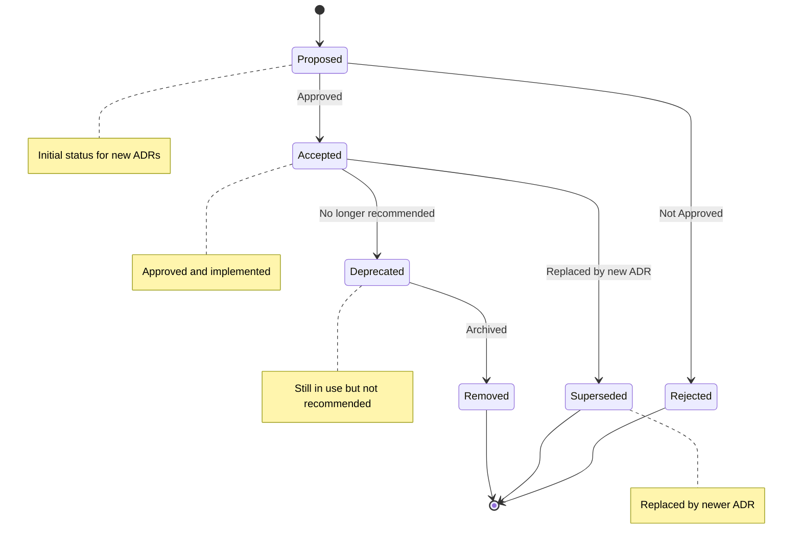

# Architecture Decision Records (ADRs)

This directory contains Architecture Decision Records (ADRs) for the FIRE Planning Tool project.

## What is an ADR?

An Architecture Decision Record (ADR) is a document that captures an important architectural decision made along with its context and consequences.

## ADR Format

Each ADR follows a standard format:
- **Title**: ADR-XXX: [Decision Title]
- **Status**: Proposed | Accepted | Deprecated | Superseded
- **Date**: When the decision was made
- **Context**: What is the issue we're seeing that motivates this decision?
- **Decision**: What is the change that we're actually proposing or doing?
- **Consequences**: What becomes easier or more difficult to do because of this change?
- **Alternatives Considered**: What other options were evaluated?

## ADR Index

### Core Architecture
- [ADR-001: Layered Architecture with Service-Oriented Design](./ADR-001-layered-architecture.md) - Accepted
- [ADR-002: .NET 9.0 and ASP.NET Core Web API](./ADR-002-dotnet-9-aspnet-core.md) - Accepted
- [ADR-003: TypeScript/ES6 Modules for Frontend](./ADR-003-typescript-es6-modules.md) - Accepted
- [ADR-004: Hebrew RTL Single-Page Application](./ADR-004-hebrew-rtl-spa.md) - Accepted

### Design Patterns
- [ADR-005: Repository Pattern for External API Access](./ADR-005-repository-pattern.md) - Accepted
- [ADR-006: Dependency Injection for Service Management](./ADR-006-dependency-injection.md) - Accepted
- [ADR-007: Service Extraction and Orchestrator Pattern](./ADR-007-service-extraction-orchestrator.md) - Accepted
- [ADR-008: Strategy Pattern for Portfolio Calculations](./ADR-008-strategy-pattern-calculations.md) - Accepted

### Security & Configuration
- [ADR-009: User Secrets for Local Development](./ADR-009-user-secrets.md) - Accepted
- [ADR-010: Rate Limiting for API Protection](./ADR-010-rate-limiting.md) - Accepted
- [ADR-011: Health Checks for Deployment](./ADR-011-health-checks.md) - Accepted
- [ADR-012: FluentValidation for Input Validation](./ADR-012-fluent-validation.md) - Accepted
- [ADR-016: Security Headers Middleware](./ADR-016-security-headers.md) - Accepted

### Domain Decisions
- [ADR-013: USD as Base Currency with Display Conversion](./ADR-013-usd-base-currency.md) - Accepted
- [ADR-017: Finnhub API with Yahoo Finance Fallback](./ADR-017-finnhub-yahoo-fallback.md) - Accepted
- [ADR-021: Money Value Object for Type-Safe Currency Handling](./ADR-021-money-value-object.md) - Accepted

### Frontend & UI
- [ADR-014: Chart.js for Data Visualization](./ADR-014-chartjs-visualization.md) - Accepted
- [ADR-018: Multi-Stage Build TypeScript Compilation](./ADR-018-typescript-build-integration.md) - Accepted
- [ADR-022: Frontend Facade, Canonical State Store, and Workflow Coordinators](./ADR-022-frontend-facade-and-coordinators.md) - Accepted

### Testing
- [ADR-015: xUnit and Jest for Testing](./ADR-015-xunit-jest-testing.md) - Accepted

## Creating a New ADR

To create a new ADR:

1. Copy the [template](./ADR-TEMPLATE.md)
2. Number it sequentially (ADR-XXX)
3. Fill in all sections with **Status**: Proposed
4. Submit for review
5. Update this index with status "Proposed"

## Managing ADR Status Changes

ADRs evolve through different statuses during their lifecycle. Update both the ADR file and this index when changing status.

### Status: Proposed → Accepted

When an ADR is approved and implemented:

1. Open the ADR file (e.g., `ADR-XXX-title.md`)
2. Change **Status**: Proposed to **Status**: Accepted
3. Update the **Date** field to the acceptance date
4. Update this index to show "Accepted" status
5. Commit with message: `Accept ADR-XXX: [Title]`

### Status: Accepted → Deprecated

When an ADR is no longer recommended but still in use:

1. Open the ADR file
2. Change **Status**: Accepted to **Status**: Deprecated
3. Add a deprecation note in the **Context** section explaining why
4. Add a **Migration Path** section if applicable
5. Update this index to show "Deprecated" status
6. Add a note pointing to the replacement ADR if one exists
7. Commit with message: `Deprecate ADR-XXX: [Title] - [Reason]`

Example index entry:
```markdown
- [ADR-XXX: Old Pattern](./ADR-XXX-old-pattern.md) - Deprecated (see ADR-YYY)
```

### Status: Accepted → Superseded

When an ADR is replaced by a newer decision:

1. Open the superseded ADR file
2. Change **Status**: Accepted to **Status**: Superseded
3. Add **Superseded By**: Reference to new ADR in the header
4. Update this index to show "Superseded by ADR-YYY"
5. Ensure the new ADR references the old one in its **Context** section
6. Commit with message: `Supersede ADR-XXX with ADR-YYY`

Example index entry:
```markdown
- [ADR-XXX: Old Approach](./ADR-XXX-old-approach.md) - Superseded by [ADR-YYY](./ADR-YYY-new-approach.md)
```

### Status: Proposed → Rejected

When an ADR is not accepted:

1. Open the ADR file
2. Change **Status**: Proposed to **Status**: Rejected
3. Add **Rejection Reason** section explaining why
4. Update **Date** to rejection date
5. Optionally remove from index or move to a "Rejected" section
6. Commit with message: `Reject ADR-XXX: [Title] - [Reason]`

## ADR Lifecycle Summary



## References

- [Architecture Decision Records](https://adr.github.io/)
- [Documenting Architecture Decisions](https://cognitect.com/blog/2011/11/15/documenting-architecture-decisions)
