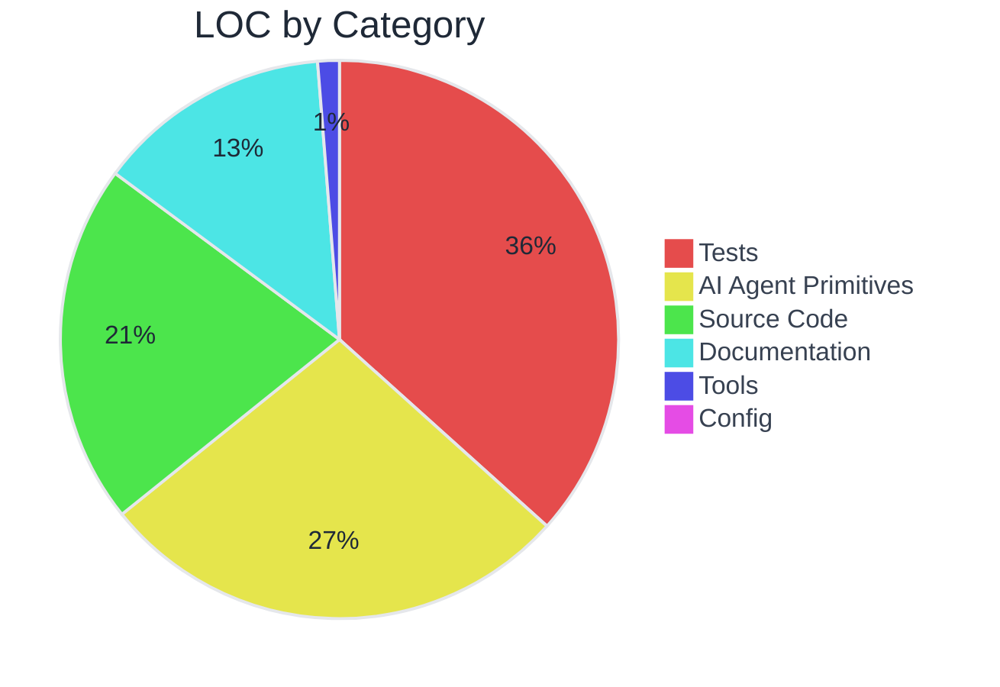
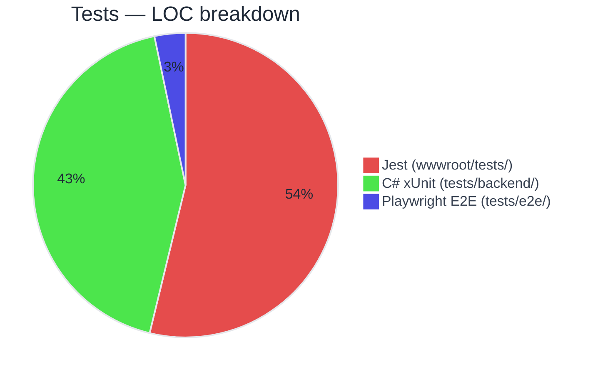
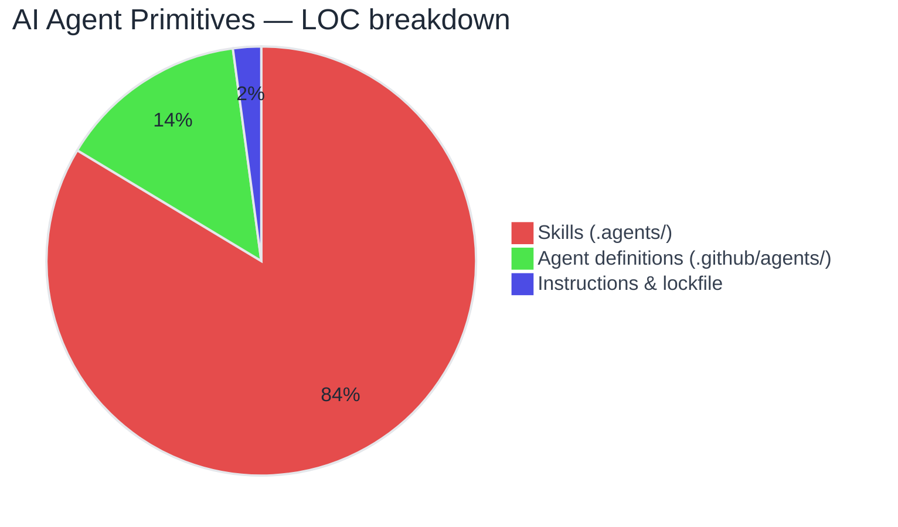
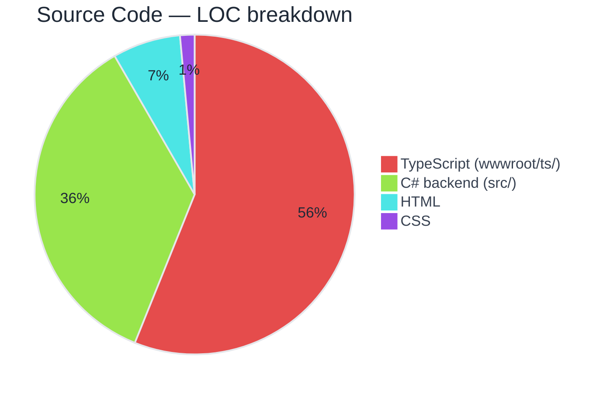
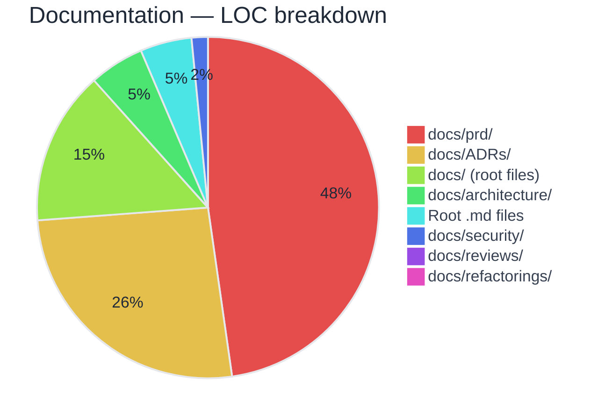
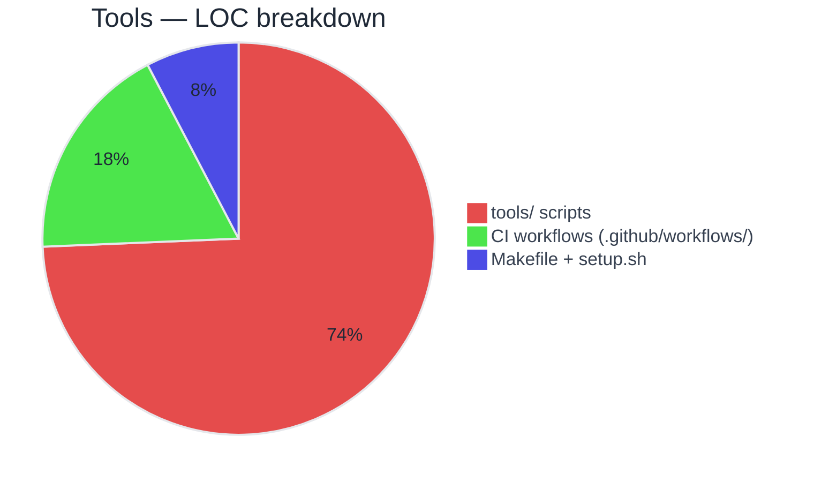
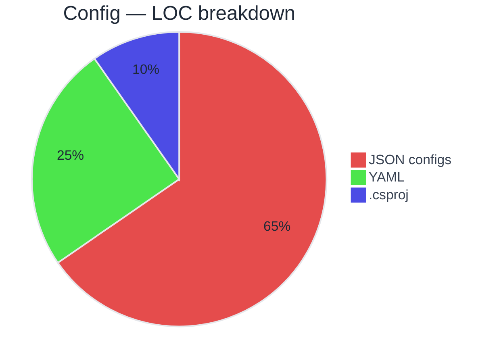

# LOC Report

Generated: 2026-03-11  
**Grand Total: 433 files · 122,426 LOC**

> Excludes: `node_modules/`, `bin/`, `obj/`, `artifacts/`, compiled JS (`wwwroot/js/`), third-party (`wwwroot/vendor/`), and lockfiles.

## Summary

| | Files | LOC | Share |
|--|------:|----:|------:|
| Tests | 147 | 44,522 | 36.4% |
| AI Agent Primitives | 116 | 33,483 | 27.3% |
| Source Code | 87 | 25,405 | 20.8% |
| Documentation | 52 | 16,518 | 13.5% |
| Tools | 10 | 1,524 | 1.2% |
| Config | 21 | 974 | 0.8% |

**Test : Code ratio:** `1.75x` (44,522 / 25,405)

## Distribution by Category

---

## Tests — 147 files · 44,522 LOC

| | Files | LOC | Share |
|--|------:|----:|------:|
| Jest (wwwroot/tests/) | 59 | 23,946 | 53.8% |
| C# xUnit (tests/backend/) | 63 | 19,117 | 42.9% |
| Playwright E2E (tests/e2e/) | 25 | 1,459 | 3.3% |

---

## AI Agent Primitives — 116 files · 33,483 LOC

| | Files | LOC | Share |
|--|------:|----:|------:|
| Skills (.agents/) | 92 | 28,000 | 83.6% |
| Agent definitions (.github/agents/) | 21 | 4,775 | 14.3% |
| Instructions & lockfile | 3 | 708 | 2.1% |

---

## Source Code — 87 files · 25,405 LOC

| | Files | LOC | Share |
|--|------:|----:|------:|
| TypeScript (wwwroot/ts/) | 34 | 14,251 | 56.1% |
| C# backend (src/) | 47 | 9,039 | 35.6% |
| HTML | 3 | 1,743 | 6.9% |
| CSS | 3 | 372 | 1.5% |

---

## Documentation — 52 files · 16,518 LOC

| | Files | LOC | Share |
|--|------:|----:|------:|
| docs/prd/ | 10 | 7,876 | 47.7% |
| docs/ADRs/ | 24 | 4,299 | 26.0% |
| docs/ (root files) | 11 | 2,405 | 14.6% |
| docs/architecture/ | 1 | 858 | 5.2% |
| Root .md files | 2 | 804 | 4.9% |
| docs/security/ | 2 | 254 | 1.5% |
| docs/reviews/ | 1 | 17 | 0.1% |
| docs/refactorings/ | 1 | 5 | 0.0% |

---

## Tools — 10 files · 1,524 LOC

| | Files | LOC | Share |
|--|------:|----:|------:|
| tools/ scripts | 6 | 1,133 | 74.3% |
| CI workflows (.github/workflows/) | 2 | 274 | 18.0% |
| Makefile + setup.sh | 2 | 117 | 7.7% |

---

## Config — 21 files · 974 LOC

| | Files | LOC | Share |
|--|------:|----:|------:|
| JSON configs | 12 | 637 | 65.4% |
| YAML | 7 | 242 | 24.8% |
| .csproj | 2 | 95 | 9.8% |

