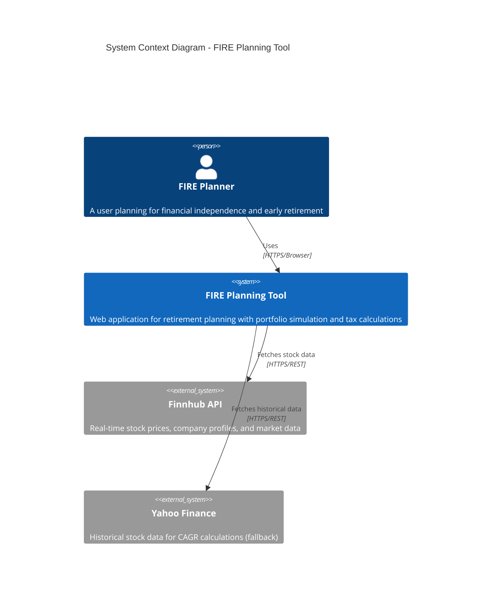
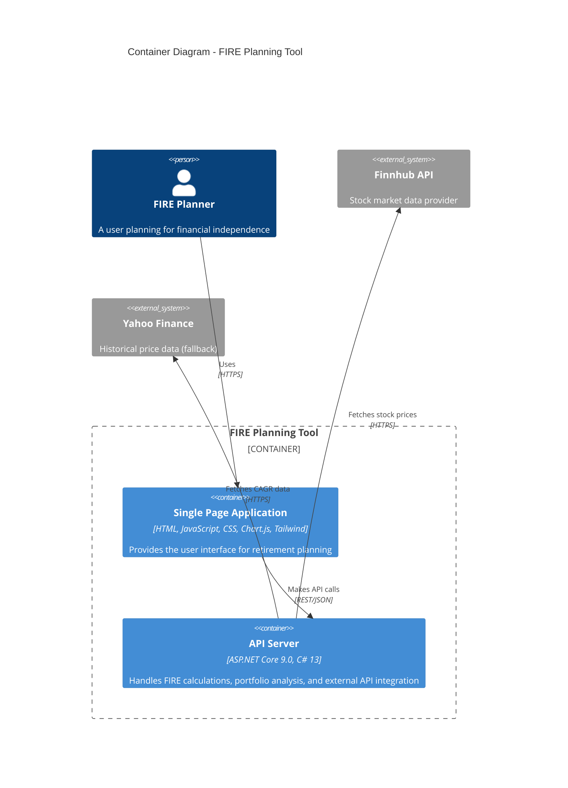
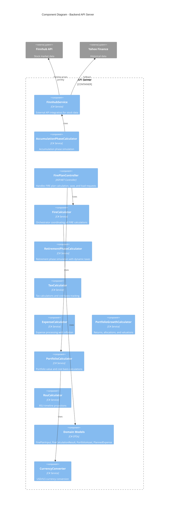
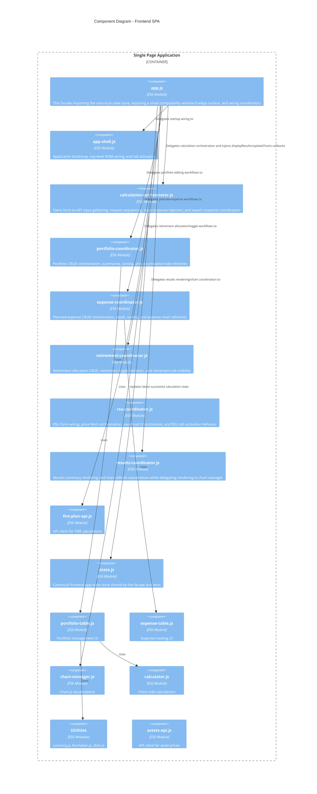
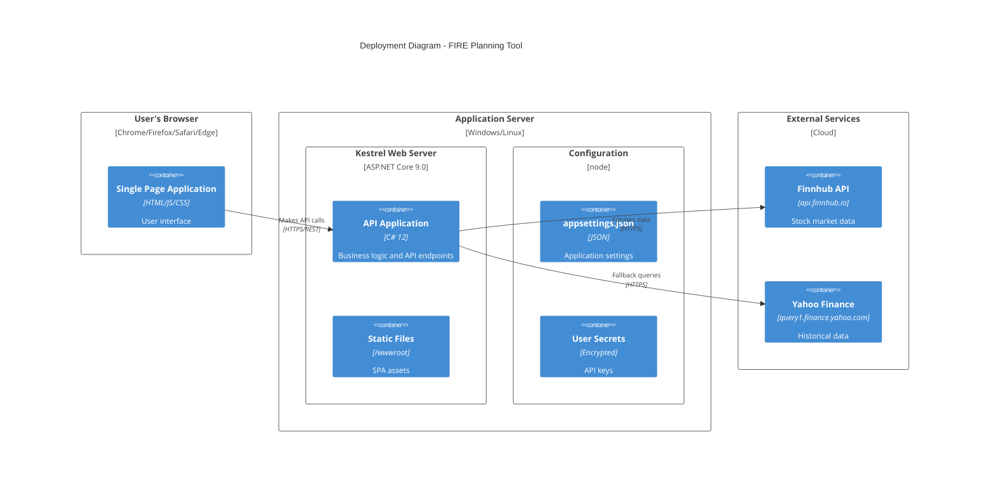
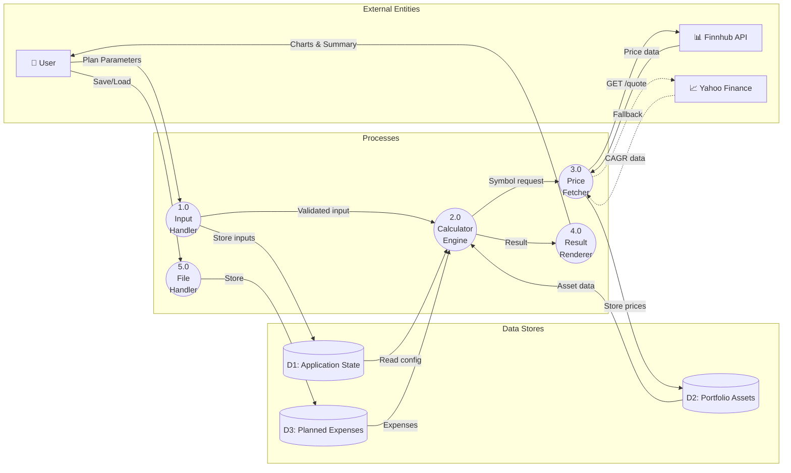
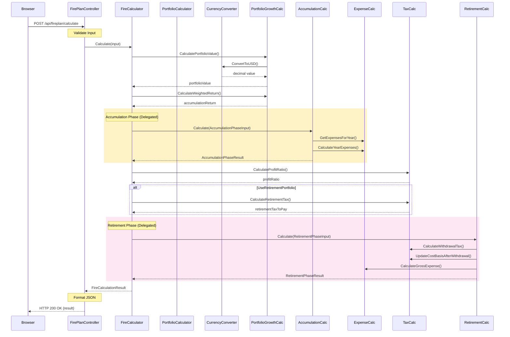

# FIRE Planning Tool - System Design Document

**Document Version:** 4.0
**Date:** January 2025
**Author:** Senior Software Architect
**Status:** Final

---

## Table of Contents

1. [Executive Summary](#1-executive-summary)
2. [System Overview](#2-system-overview)
3. [Architecture Diagrams](#3-architecture-diagrams)
4. [Component Design](#4-component-design)
5. [Data Models](#5-data-models)
6. [API Design](#6-api-design)
7. [Security Architecture](#7-security-architecture)
8. [Technology Stack](#8-technology-stack)
9. [Design Patterns](#9-design-patterns)
10. [Quality Attributes](#10-quality-attributes)

---

## 1. Executive Summary

### 1.1 Purpose

The FIRE Planning Tool is a comprehensive web application for Financial Independence, Retire Early (FIRE) planning. It enables users to simulate portfolio growth, calculate retirement projections, and plan major expenses with real-time stock price integration.

### 1.2 Key Features

| Feature | Description |
|---------|-------------|
| **Portfolio Simulation** | Monte Carlo simulation with real stock data |
| **FIRE Calculations** | Multi-phase retirement projections |
| **Tax Planning** | Capital gains tax implications |
| **Currency Support** | USD/ILS with Money value object for type-safe handling |
| **Plan Management** | Save/load plans as JSON files |
| **Real-time Data** | Live stock prices via Finnhub API |

### 1.3 Architecture Style

The system follows a **Layered Architecture** pattern with clear separation of concerns:

- **Frontend:** Single Page Application (SPA) with modular TypeScript/JavaScript (ES6 Modules)
- **Backend:** ASP.NET Core Web API with service-oriented design
- **Integration:** RESTful APIs for external service communication

---

## 2. System Overview

### 2.1 System Context

The FIRE Planning Tool operates within the following context:

**Primary Actors:**
- End Users (FIRE planners)
- System Administrators

**External Systems:**
- Finnhub Stock API (real-time stock prices)
- Yahoo Finance API (historical CAGR fallback)
- File System (JSON plan storage)

### 2.2 Functional Decomposition

```
FIRE Planning Tool
├── User Interface Layer
│   ├── Input Management (Plan Settings, Portfolio, Expenses)
│   ├── Visualization (Charts - Donut, Line, Bar)
│   ├── Plan Management (Save/Load)
│   └── Currency Switching
│
├── API Layer
│   ├── FirePlanController (Calculate, Save, Load)
│   └── AssetPricesController (Single, Batch, CAGR, Company Name)
│
├── Business Logic Layer
│   ├── FireCalculator (Orchestrator - coordinates all calculations)
│   ├── AccumulationPhaseCalculator (Accumulation phase simulation)
│   ├── RetirementPhaseCalculator (Retirement phase simulation)
│   ├── TaxCalculator (Profit ratios, tax rates, cost basis tracking)
│   ├── ExpenseCalculator (Expense processing, inflation adjustments)
│   ├── PortfolioGrowthCalculator (Returns, allocations, valuations)
│   ├── PortfolioCalculator (Value & Cost Basis)
│   ├── CurrencyConverter (USD/ILS)
│   └── RsuCalculator (RSU timeline projections)
│
└── Integration Layer
    └── FinnhubService (Stock Prices, Company Profiles, Historical Data)
```

---

## 3. Architecture Diagrams

### 3.1 System Context Diagram

The system context diagram illustrates the high-level relationship between the FIRE Planning Tool and its external entities. The user interacts with the web browser, which communicates with the backend API server. The backend fetches real-time stock data from Finnhub API and falls back to Yahoo Finance for historical CAGR calculations.



### 3.2 Container Diagram (C4 Level 2)

The application consists of two primary containers:

| Container | Technology | Purpose |
|-----------|------------|---------|
| **Web Browser** | HTML/JS/CSS | User interface, client-side logic |
| **API Server** | ASP.NET Core 9.0 | Business logic, API endpoints |



### 3.3 Component Diagram (C4 Level 3)

#### Backend Components



#### Frontend Components



### 3.4 Deployment Architecture



---

## 4. Component Design

### 4.0 Data Flow

The data flow diagram shows how data moves through the system:



**Data Flow Steps:**
1. User inputs plan parameters via the browser
2. Input Handler validates and stores in Application State
3. Calculator Engine processes the data using Portfolio and Expense data
4. Price Fetcher retrieves real-time stock data from external APIs
5. Result Renderer displays charts and summary to the user
6. File Handler manages save/load operations

### 4.1 Calculation Sequence



### 4.2 FireCalculator Service (Refactored)

**Architecture:** Orchestrator pattern coordinating specialized calculators.

**Status:** ✅ Refactored (December 2025) - Reduced from 533 lines to 287 lines

The FireCalculator now acts as an orchestrator, delegating to focused services:
- **AccumulationPhaseCalculator** - Accumulation phase simulation (129 lines)
- **RetirementPhaseCalculator** - Retirement phase simulation (184 lines)
- **TaxCalculator** - Tax calculations and cost basis tracking (68 lines)
- **ExpenseCalculator** - Expense processing with inflation (77 lines)
- **PortfolioGrowthCalculator** - Returns, allocations, valuations (152 lines)

#### Responsibilities:
1. Orchestrate calculation workflow
2. Setup and initialization
3. RSU timeline calculation
4. Result aggregation
3. Handle planned expenses with inflation adjustment
4. Calculate tax implications

#### Algorithm Flow:

```
1. Initialize
   ├── Calculate current portfolio value from holdings
   ├── Determine accumulation years (retirement year - current year)
   └── Calculate weighted returns for accumulation/retirement portfolios

2. Accumulation Phase (for each year)
   ├── Apply monthly growth (return / 12)
   ├── Add monthly contributions
   └── Deduct planned expenses (inflation-adjusted)

3. Peak Value Calculation
   ├── Calculate tax basis
   ├── Calculate profit ratio
   └── Apply retirement tax if switching portfolios

4. Retirement Phase (for each year)
   ├── Apply inflation to withdrawal amount
   ├── Calculate effective tax rate
   ├── Apply monthly growth
   ├── Deduct monthly withdrawal
   ├── Update cost basis and profit ratio
   └── Handle planned expenses

5. Return Results
   └── YearlyData, PeakValue, EndValue, Withdrawals
```

### 4.3 FinnhubService

External API integration service for stock market data.

#### Features:
- **Stock Prices:** Real-time quotes via `/quote` endpoint
- **Company Names:** Profile data via `/stock/profile2` endpoint
- **Historical CAGR:** Candle data via `/stock/candle` endpoint
- **Fallback:** Yahoo Finance API when Finnhub fails

#### Security Measures:
- Symbol validation (regex: `^[A-Za-z0-9.\-]+$`)
- URL encoding to prevent injection
- API key from user secrets (not hardcoded)

### 4.3 PortfolioCalculator

Handles portfolio value calculations with currency conversion.

#### Methods:
- `CalculateCostBasis()` - Total cost of holdings
- `CalculateMarketValue()` - Current market value
- `CalculateUnrealizedGainLoss()` - Profit/loss
- `CalculateExposurePercentage()` - Asset allocation

### 4.4 CurrencyConverter

Manages USD/ILS currency conversion.

#### Exchange Rate Handling:
- Default rate: 3.6 USD/ILS
- User-configurable via UI
- Converts from any supported currency to display currency

---

## 5. Data Models

### 5.1 Core Domain Models

```
FirePlanInput
├── birthYear: int
├── earlyRetirementYear: int
├── fullRetirementAge: int
├── monthlyContribution: decimal
├── monthlyContributionCurrency: string
├── currency: string
├── usdIlsRate: decimal
├── withdrawalRate: decimal
├── inflationRate: decimal
├── capitalGainsTax: decimal
├── taxBasis: decimal?
├── expenses: List<PlannedExpense>
├── accumulationPortfolio: List<PortfolioAsset>
├── retirementPortfolio: List<PortfolioAsset>
├── accumulationAllocation: List<PortfolioAllocation>
├── retirementAllocation: List<PortfolioAllocation>
├── investmentStrategy: string
├── currentPortfolioValue: decimal
└── useRetirementPortfolio: bool
```

```
PortfolioAsset
├── id: long
├── symbol: string
├── quantity: decimal
├── currentPrice: decimal
├── currentPriceCurrency: string
├── averageCostPerShare: decimal
├── averageCostCurrency: string
├── method: string (CAGR|צמיחה כוללת|מחיר יעד)
├── value1: decimal
└── value2: decimal
```

```
PlannedExpense
├── id: long
├── type: string
├── netAmount: decimal
├── currency: string
├── year: int
├── frequencyYears: int
└── repetitionCount: int
```

### 5.2 Calculation Result Models

```
FireCalculationResult
├── totalContributions: decimal
├── peakValue: decimal
├── grossPeakValue: decimal
├── retirementTaxToPay: decimal
├── endValue: decimal
├── grossAnnualWithdrawal: decimal
├── netMonthlyExpense: decimal
├── yearlyData: List<YearlyData>
├── accumulationPortfolio: List<PortfolioAsset>
├── retirementPortfolio: List<PortfolioAsset>
├── currentValue: decimal
├── accumulationAllocation: List<PortfolioAllocation>
├── retirementAllocation: List<PortfolioAllocation>
├── accumulationWeightedReturn: decimal
└── retirementWeightedReturn: decimal
```

---

## 6. API Design

### 6.1 RESTful Endpoints

| Method | Endpoint | Description |
|--------|----------|-------------|
| POST | `/api/fireplan/calculate` | Calculate FIRE projection |
| POST | `/api/fireplan/save` | Serialize plan to JSON |
| POST | `/api/fireplan/load` | Deserialize plan from JSON |
| GET | `/api/assetprices/{symbol}` | Get single stock price |
| POST | `/api/assetprices/batch` | Get multiple stock prices |
| GET | `/api/assetprices/{symbol}/name` | Get company name |
| GET | `/api/assetprices/{symbol}/cagr` | Get historical CAGRs |

### 6.2 Request/Response Patterns

**Calculate Request:**
```json
{
  "birthYear": 1990,
  "earlyRetirementYear": 2040,
  "fullRetirementAge": 67,
  "monthlyContribution": 10000,
  "withdrawalRate": 4,
  "inflationRate": 2,
  "capitalGainsTax": 25,
  "accumulationPortfolio": [...]
}
```

**Calculate Response:**
```json
{
  "totalContributions": 500000,
  "peakValue": 2000000,
  "endValue": 1500000,
  "grossAnnualWithdrawal": 80000,
  "netMonthlyExpense": 5000,
  "yearlyData": [...]
}
```

### 6.3 Error Handling

All errors follow a consistent format:

```json
{
  "error": "Human-readable error message"
}
```

HTTP Status Codes:
- **200:** Success
- **400:** Validation error or bad request
- **404:** Resource not found (e.g., stock symbol)
- **500:** Internal server error

---

## 7. Security Architecture

### 7.1 Security Controls

| Control | Implementation |
|---------|----------------|
| **API Key Management** | .NET User Secrets (development), Environment Variables (production) |
| **CORS** | Restricted to localhost in development, configurable in production |
| **Input Validation** | Symbol regex validation, request size limits |
| **Content Security Policy** | Configured for CDN resources |
| **Security Headers** | X-Frame-Options, X-Content-Type-Options, X-XSS-Protection |

### 7.2 Security Headers (Middleware)

```csharp
// Configured in src/Program.cs
X-Frame-Options: SAMEORIGIN
X-Content-Type-Options: nosniff
X-XSS-Protection: 1; mode=block
Referrer-Policy: strict-origin-when-cross-origin
Content-Security-Policy: default-src 'self' 'unsafe-inline'...
```

### 7.3 Request Size Limits

- API endpoints: 5MB max request size
- Multipart forms: 10MB limit
- JSON depth: Maximum 32 levels
- Portfolio items: Maximum 1000

---

## 8. Technology Stack

### 8.1 Backend Technologies

| Component | Technology | Version |
|-----------|------------|---------|
| Runtime | .NET | 9.0 |
| Framework | ASP.NET Core | 9.0 |
| Language | C# | 13 |
| Web Server | Kestrel | Built-in |
| Dependency Injection | Microsoft.Extensions.DI | Built-in |
| HTTP Client | HttpClient | Built-in |
| JSON Serialization | System.Text.Json | Built-in |

### 8.2 Frontend Technologies

| Component | Technology | Version |
|-----------|------------|---------|
| Markup | HTML5 | - |
| Styling | Tailwind CSS | 3.x (CDN) |
| Scripting | TypeScript/ES6 JavaScript | - |
| Charts | Chart.js | 4.x (CDN) |
| Module System | ES6 Modules | Native |
| Build Tool | TypeScript Compiler | 5.x |

### 8.3 Testing Technologies

| Component | Technology | Purpose |
|-----------|------------|---------|
| Unit Tests | xUnit | Backend testing |
| Assertions | FluentAssertions | Readable assertions |
| Frontend Tests | Jest | JavaScript testing |
| Coverage | Coverlet | Code coverage |

### 8.4 Development Tools

| Tool | Purpose |
|------|---------|
| Make | Task runner |
| Git | Version control |
| GitHub Actions | CI/CD |
| Codecov | Coverage reporting |

---

## 9. Design Patterns

### 9.1 Patterns Used

| Pattern | Location | Purpose |
|---------|----------|---------|
| **Dependency Injection** | src/Program.cs, src/Controllers | Loose coupling |
| **Repository Pattern** | FinnhubService | Data access abstraction |
| **Strategy Pattern** | Portfolio calculation methods | Algorithm selection |
| **Value Object Pattern** | Money type (C# & TypeScript) | Type-safe currency handling |
| **Module Pattern** | Frontend JS | Encapsulation |
| **Observer Pattern** | Event listeners | UI reactivity |
| **Factory Pattern** | createPortfolioAsset(), Money.Usd() | Object creation |

### 9.2 Architectural Patterns

| Pattern | Description |
|---------|-------------|
| **Layered Architecture** | Separation into API, Service, Model layers |
| **Service-Oriented** | Business logic in dedicated services |
| **Single Page Application** | Client-side routing, state management |
| **API Gateway** | Controllers as facade to services |

### 9.3 Frontend State Management

```javascript
// Centralized state object
const state = {
    accumulationPortfolio: [],
    retirementAllocation: [...],
    expenses: [],
    exchangeRates: { usdToIls: 3.6, ilsToUsd: 1/3.6 },
    displayCurrency: '$',
    lastCalculationResult: null,
    useRetirementPortfolio: false
};
```

State changes trigger UI updates through:
1. Direct DOM manipulation
2. Chart.js data updates
3. Table re-rendering

---

## 10. Quality Attributes

### 10.1 Performance

| Metric | Target | Current |
|--------|--------|---------|
| API Response | < 200ms | ~200ms |
| Calculation (20 years) | < 100ms | ~50ms |
| Frontend Load | < 2s | ~1.5s |
| External API (cached) | < 100ms | 500-1000ms (no cache) |

### 10.2 Reliability

- **Test Coverage:** High (comprehensive test suites)
- **Test Count:** 1,841 tests (835 xUnit backend + 1,006 Jest frontend)
- **Error Handling:** Centralized exception handling

### 10.3 Maintainability

| Aspect | Status |
|--------|--------|
| Code Organization | Modular services and components |
| Documentation | Comprehensive (API.md, README, etc.) |
| Testing | Well-structured test suites |
| Configuration | Externalized (appsettings, user secrets) |

### 10.4 Scalability Considerations

Current architecture supports:
- **Horizontal scaling:** Stateless API design
- **Caching readiness:** Can add memory/distributed cache
- **External API abstraction:** Can swap providers

Future improvements identified:
- Add response caching
- Implement rate limiting
- Add health checks

### 10.5 Internationalization

| Feature | Implementation |
|---------|----------------|
| RTL Support | Complete (Hebrew interface) |
| Currency | USD/ILS with conversion |
| Locale | Hebrew text, RTL layout |
| Date Format | ISO 8601 |

---

## Appendix A: File Structure

```
fire/
├── src/                                 # Backend C# source code
│   ├── Controllers/
│   │   ├── FirePlanController.cs        (177 lines)
│   │   └── AssetPricesController.cs     (205 lines)
│   ├── Services/
│   │   ├── FireCalculator.cs            (376 lines)
│   │   ├── FinnhubService.cs            (558 lines)
│   │   ├── PortfolioCalculator.cs       (85 lines)
│   │   ├── CurrencyConverter.cs         (74 lines)
│   │   └── CalculationConstants.cs      (126 lines)
│   ├── Models/
│   │   ├── FirePlanModels.cs            (139 lines)
│   │   └── AssetPriceModels.cs          (asset price DTOs)
│   ├── ValueObjects/                    # Money value object
│   │   ├── Money.cs                     (152 lines)
│   │   └── SupportedCurrencies.cs       (123 lines)
│   └── Program.cs                       (135 lines)
├── wwwroot/
│   ├── index.html                   (464 lines - minimal shell)
│   ├── css/
│   │   └── styles.css               (custom styles)
│   └── js/                          (~3900 lines total)
│       ├── app.js                   (facade + compatibility-focused public API)
│       ├── app-shell.js             (bootstrap wiring + tab activation)
│       ├── orchestration/           (frontend workflow coordinators)
│       │   ├── portfolio-coordinator.js
│       │   ├── expense-coordinator.js
│       │   ├── retirement-coordinator.js
│       │   ├── rsu-coordinator.js
│       │   └── results-coordinator.js
│       ├── api/                     (API clients)
│       │   ├── assets-api.js
│       │   └── fire-plan-api.js
│       ├── components/              (UI components)
│       │   ├── portfolio-table.js
│       │   ├── expense-table.js
│       │   └── chart-manager.js
│       ├── services/                (Business logic + canonical app state)
│       │   ├── calculator.js
│       │   └── state.js
│       ├── utils/                   (Utilities)
│       │   ├── currency.js
│       │   ├── formatter.js
│       │   └── dom.js
│       ├── config/                  (Configuration)
│       └── types/                   (TypeScript types)
├── tests/                               (Test suites)
├── docs/                                (Documentation)
└── FirePlanningTool.csproj
```

---

## Appendix B: Glossary

| Term | Definition |
|------|------------|
| FIRE | Financial Independence, Retire Early |
| CAGR | Compound Annual Growth Rate |
| SWR | Safe Withdrawal Rate (typically 4%) |
| RTL | Right-to-Left (text direction) |
| SPA | Single Page Application |
| DTO | Data Transfer Object |
| DI | Dependency Injection |

---

## Appendix C: Version History

| Version | Date | Author | Changes |
|---------|------|--------|---------|
| 1.0 | Nov 2024 | Architecture Team | Initial architecture documentation |
| 2.0 | Nov 2025 | Senior Architect | Comprehensive design document with diagrams |
| 3.0 | Dec 2025 | Architecture Team | Updated to reflect modular frontend, .NET 9.0, 357 tests |
| 4.0 | Jan 2025 | Architecture Team | Added Money value object pattern, updated test count to 1,841 |

---

**End of Document**
