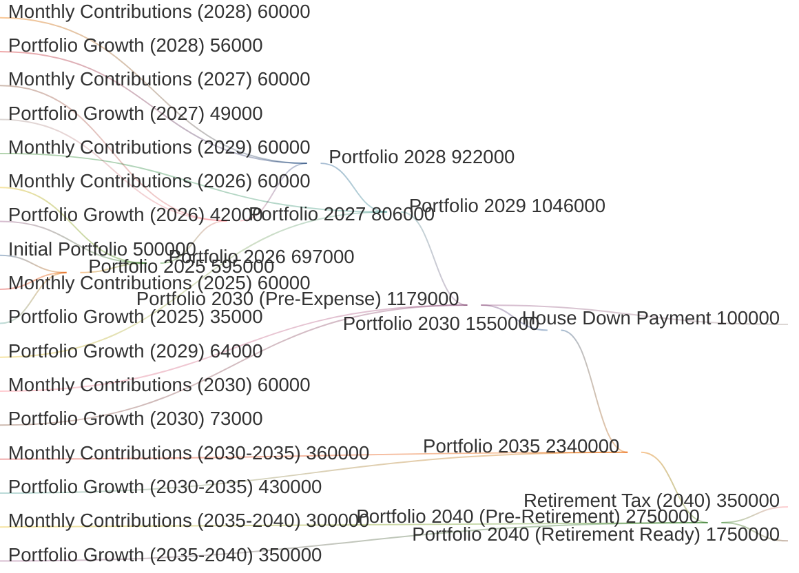
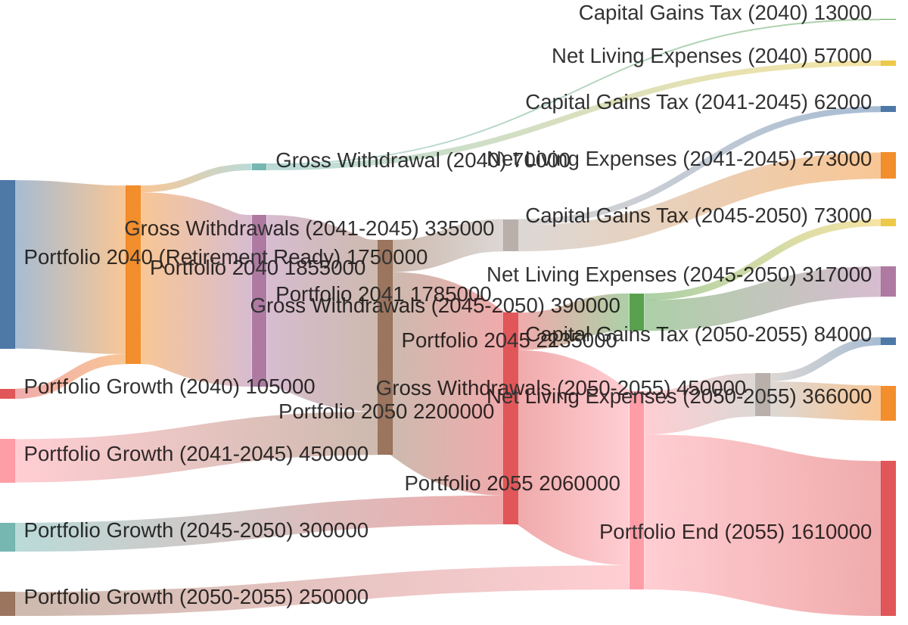

# Product Requirements Document: Sankey Chart Money Flow Visualization

**Version:** 1.0  
**Last Updated:** December 2025  
**Owner:** Senior Data Analyst - Fintech Industry  
**Status:** Proposed Feature  
**Parent PRD:** PRD_FIRE_PLANNING_TOOL.md, PRD_VISUALIZATION.md

---

## Table of Contents

1. [Executive Summary](#1-executive-summary)
2. [Problem Statement](#2-problem-statement)
3. [User Personas & Needs](#3-user-personas--needs)
4. [Proposed Solution](#4-proposed-solution)
5. [Money Flow Analysis](#5-money-flow-analysis)
6. [Sankey Diagram Specifications](#6-sankey-diagram-specifications)
7. [Feature Requirements](#7-feature-requirements)
8. [UI/UX Design](#8-uiux-design)
9. [Technical Architecture](#9-technical-architecture)
10. [Data Model Extensions](#10-data-model-extensions)
11. [API Specifications](#11-api-specifications)
12. [Implementation Plan](#12-implementation-plan)
13. [Success Metrics](#13-success-metrics)
14. [Future Enhancements](#14-future-enhancements)

---

## 1. Executive Summary

### 1.1 Overview

This PRD proposes adding a **Sankey Diagram** to the FIRE Planning Tool to visualize the complete money flow throughout the user's financial journey. The visualization will provide an intuitive, year-by-year breakdown of:

- **Income Sources**: Monthly savings contributions, RSU vesting proceeds, portfolio growth
- **Portfolio Accumulation**: How money flows into and grows within the investment portfolio
- **Outflows**: Taxes (capital gains), planned expenses, retirement withdrawals
- **Net Worth Evolution**: Year-over-year portfolio value transitions

### 1.2 Value Proposition

As a **Senior Data Analyst in the Fintech industry**, I understand that:

> **"Financial planning is about understanding the story of your money - where it comes from, where it goes, and how it transforms over time."**

The Sankey diagram transforms complex FIRE calculations into a compelling visual narrative, making it easier for users to:

✅ **Understand** the complete money flow lifecycle  
✅ **Identify** inefficiencies (high taxes, suboptimal withdrawal strategies)  
✅ **Optimize** contribution amounts, retirement timing, and expense planning  
✅ **Communicate** financial plans to family members or advisors  
✅ **Build confidence** in retirement readiness through transparency

### 1.3 Key Differentiators

| Feature | Traditional Line Charts | Sankey Money Flow |
|---------|------------------------|-------------------|
| **Money Sources** | Not visible | Explicit (contributions, growth, RSU) |
| **Tax Visualization** | Implicit in net values | Explicit flow and amounts |
| **Expense Impact** | Bars on separate chart | Integrated into main flow |
| **Phase Transitions** | Color coding | Explicit flow splitting |
| **Cumulative Understanding** | Requires mental math | Visual proportions |

---

## 2. Problem Statement

### 2.1 Current State Challenges

**Problem 1: Hidden Money Flows**
- Users see portfolio value over time but not the **composition** of inflows/outflows
- Example: "My portfolio is ₪5M at retirement - but how much came from contributions vs. growth?"

**Problem 2: Tax Impact Opacity**
- Capital gains taxes are embedded in withdrawal calculations
- Users don't see **how much** they're paying in taxes each year
- Example: "I'm withdrawing ₪300K/year - how much is tax vs. net expenses?"

**Problem 3: Disconnected Views**
- Expenses are shown in a separate bar chart
- RSU contributions appear in tables but not visually integrated
- No single view shows the **complete picture**

**Problem 4: Phase Transition Confusion**
- The switch from accumulation to retirement is a critical moment
- Users don't see the **rebalancing tax event** when switching portfolios
- Example: "What happens to my money the day I retire?"

### 2.2 User Pain Points

| User Persona | Pain Point | Quote |
|--------------|------------|-------|
| **Israeli Tech Worker** | "I want to see how my RSU vesting contributes to my FIRE timeline" | *"Are my RSUs making a real difference?"* |
| **Financial Enthusiast** | "I need to optimize my tax strategy" | *"Where are my tax dollars going?"* |
| **Conservative Planner** | "I want to see if my expenses are sustainable" | *"Will my money last?"* |
| **Family Communicator** | "I need to explain my plan to my spouse" | *"How can I make this simple?"* |

### 2.3 Success Criteria

A successful solution will enable users to:

1. **Answer in 10 seconds**: "How much of my retirement portfolio is growth vs. contributions?"
2. **Identify in 30 seconds**: "Which year has the highest tax burden?"
3. **Optimize in 5 minutes**: "Should I delay retirement by 1 year to reduce the tax event?"
4. **Explain in 2 minutes**: "Here's where our money comes from and where it goes"

---

## 3. User Personas & Needs

### 3.1 Primary Persona: Data-Driven Planner

**Name:** Sarah (age 38)  
**Role:** Senior Software Engineer  
**FIRE Goal:** Retire at 52  
**Annual Income:** ₪800K (salary + RSU)  
**Current Portfolio:** ₪2.5M

**Needs:**
- ✅ See year-by-year money flows to identify optimization opportunities
- ✅ Understand tax impact of different retirement dates
- ✅ Visualize RSU contribution to FIRE timeline
- ✅ Compare accumulation vs. retirement phase dynamics

**Quote:** *"I love numbers, but I need to see the big picture. Where does my money actually go?"*

### 3.2 Secondary Persona: Visual Learner

**Name:** David (age 45)  
**Role:** Small Business Owner  
**FIRE Goal:** Comfortable retirement at 60  
**Annual Income:** ₪600K (variable)  
**Current Portfolio:** ₪4M

**Needs:**
- ✅ Intuitive visualization that doesn't require financial expertise
- ✅ Clear understanding of expense sustainability
- ✅ Simple way to show family members the plan
- ✅ Confidence that the numbers "add up"

**Quote:** *"I'm not a numbers person - show me the flow, not the formulas."*

### 3.3 Tertiary Persona: Tax Optimizer

**Name:** Rachel (age 42)  
**Role:** Financial Analyst  
**FIRE Goal:** Minimize lifetime taxes  
**Annual Income:** ₪1M  
**Current Portfolio:** ₪6M

**Needs:**
- ✅ Detailed breakdown of tax events (retirement rebalancing, annual capital gains)
- ✅ Ability to identify high-tax years
- ✅ Understanding of withdrawal strategies impact
- ✅ Optimization of contribution timing

**Quote:** *"Every shekel of tax paid is a shekel that doesn't compound. Show me where I'm bleeding."*


## 4. Proposed Solution

### 4.1 Solution Overview

Implement an **interactive Sankey diagram** that visualizes the complete money flow from current year to end of retirement. The diagram will:

1. **Flow Structure**: Left-to-right (RTL: right-to-left for Hebrew) showing time progression
2. **Nodes**: Represent financial states (portfolio value at each year)
3. **Links**: Represent money movements (contributions, growth, taxes, withdrawals)
4. **Interactivity**: Hover tooltips, year selection, filter by flow type

### 4.2 Visualization Approach

```
Year N → Year N+1 → Year N+2 → ... → Retirement Year → ... → End Year

Each year:
  Inflows:
    ├─ Monthly Contributions ($)
    ├─ Portfolio Growth (%)
    └─ RSU Net Proceeds ($)
  
  Outflows:
    ├─ Capital Gains Tax ($)
    ├─ Planned Expenses ($)
    └─ Retirement Withdrawals ($)
  
  Net: Portfolio Value at Year End
```

### 4.3 Key Design Decisions

| Decision | Rationale |
|----------|-----------|
| **Sankey (not Waterfall)** | Sankey better shows proportional flows and splits/merges |
| **Year-by-Year (not cumulative)** | Easier to identify specific year issues |
| **Integrated (not separate chart)** | One view shows complete picture |
| **Interactive (not static)** | Users can drill down by year/flow type |
| **USD normalized** | Consistent currency for accurate proportions |

---

## 5. Money Flow Analysis

### 5.1 Flow Categories

#### 5.1.1 Accumulation Phase Inflows

| Flow Type | Source | Formula | Frequency |
|-----------|--------|---------|-----------|
| **Monthly Contributions** | User's salary | `MonthlyContribution × 12` | Annual |
| **Portfolio Growth** | Investment returns | `PortfolioValue × (1 + Return)^(1/12)^12 - PortfolioValue` | Annual |
| **RSU Net Proceeds** | Stock vesting | `RsuData.NetSaleProceeds` (after Section 102 tax) | Annual |
| **Initial Portfolio** | Existing holdings | `CalculatePortfolioValue(AccumulationPortfolio)` | Year 0 only |

#### 5.1.2 Accumulation Phase Outflows

| Flow Type | Purpose | Formula | Frequency |
|-----------|---------|---------|-----------|
| **Planned Expenses** | Large purchases | `NetAmount × (1 + Inflation)^Years` | As planned |
| **RSU Taxes Paid** | Section 102 tax | `RsuData.TaxesPaid` | Annual (if RSU) |

#### 5.1.3 Retirement Phase Inflows

| Flow Type | Source | Formula | Frequency |
|-----------|--------|---------|-----------|
| **Portfolio Growth** | Investment returns | `PortfolioValue × RetirementReturn / 100` | Annual |
| **RSU Net Proceeds** | Continued vesting | `RsuData.NetSaleProceeds` | Annual (if applicable) |

#### 5.1.4 Retirement Phase Outflows

| Flow Type | Purpose | Formula | Frequency |
|-----------|---------|---------|-----------|
| **Retirement Withdrawals (Gross)** | Living expenses | `PeakValue × WithdrawalRate × (1 + Inflation)^Years` | Annual |
| **Capital Gains Tax** | Tax on withdrawals | `GrossWithdrawal × ProfitRatio × CapitalGainsTax` | Annual |
| **Planned Expenses** | Large purchases | `NetAmount × (1 + Inflation)^Years` | As planned |

#### 5.1.5 Special Events

| Event | Impact | When |
|-------|--------|------|
| **Retirement Rebalancing Tax** | One-time capital gains tax when switching to retirement portfolio | Retirement year |
| **Portfolio Exhaustion** | Flows stop when portfolio reaches zero | Any year |

### 5.2 Flow Dependencies

```
Portfolio Value (Year N+1) = 
  Portfolio Value (Year N)
  + Monthly Contributions
  + Portfolio Growth
  + RSU Net Proceeds
  - Capital Gains Tax
  - Planned Expenses
  - Retirement Withdrawals
```

---

## 6. Sankey Diagram Specifications

### 6.1 Sample Data Scenario

**User Profile:**
- Current Age: 35 (Year 2025)
- Retirement Age: 50 (Year 2040)
- Current Portfolio: $500K
- Monthly Contribution: $5K ($60K/year)
- Portfolio Return: 7% annually
- Inflation: 3% annually
- Capital Gains Tax: 25%
- Withdrawal Rate: 4%
- Planned Expenses: $100K in 2030 (house down payment)

**Key Milestones:**
- 2025: Current year, portfolio = $500K
- 2030: Large expense year (house), portfolio ≈ $950K → $850K
- 2040: Retirement year, portfolio ≈ $2.1M, retirement tax ≈ $350K, net ≈ $1.75M
- 2055: End year (age 80), portfolio ≈ $800K (if sustainable)

### 6.2 Mermaid Sankey Diagrams

For better readability, the money flow is split into **two separate diagrams**: one for the accumulation phase and one for the retirement phase. Users can view each phase independently to focus on the relevant financial dynamics.

#### 6.2.1 Accumulation Phase Diagram (2025-2040)

This diagram shows the wealth-building years, including contributions, portfolio growth, and large expenses.



**Key Insights - Accumulation Phase:**
- Initial portfolio ($500K) grows to $2.1M over 15 years
- Contributions: $900K total ($60K/year × 15 years)
- Portfolio growth: $700K (compounded returns at 7%)
- Large expense in 2030: $100K house down payment
- Retirement tax event: $350K (capital gains on rebalancing)
- Net portfolio at retirement: $1.75M

#### 6.2.2 Retirement Phase Diagram (2040-2055)

This diagram shows the withdrawal years, including annual withdrawals, taxes, and portfolio sustainability.



**Key Insights - Retirement Phase:**
- Starting portfolio: $1.75M (post-retirement tax)
- Portfolio continues growing at 6% annually
- Gross withdrawals: 4% of portfolio (inflation-adjusted)
- Capital gains tax: ~18-19% of each withdrawal (profit ratio × 25% tax)
- Net annual expenses: Start at $57K, grow with 3% inflation
- End portfolio at age 80: $1.61M (sustainable through age 80+)

### 6.3 Diagram Legend

| Node Type | Color | Description |
|-----------|-------|-------------|
| **Portfolio Value** | Blue | Portfolio balance at year end |
| **Contributions** | Green | Monthly savings contributions |
| **Portfolio Growth** | Teal | Investment returns |
| **RSU Proceeds** | Purple | Net RSU vesting proceeds |
| **Taxes** | Orange | Capital gains taxes paid |
| **Expenses** | Red | Planned large expenses |
| **Withdrawals** | Pink | Retirement living expenses (net) |

### 6.4 Flow Width Encoding

```
Flow Width ∝ Money Amount

Example:
  $100K → 1px width
  $500K → 5px width
  $1M → 10px width
```

This creates **intuitive proportional visualization** - larger flows are literally thicker.


## 7. Feature Requirements

### 7.1 Core Features

#### F1: Multi-Year Sankey Visualization
- Generate Sankey diagram data from existing `YearlyData` results
- Show all inflow types: contributions, growth, RSU proceeds
- Show all outflow types: taxes, expenses, withdrawals
- Display portfolio value nodes at each year transition

#### F2: Interactive Phase Selection & Year Range
- **Phase Toggle**: Switch between "Accumulation Phase" and "Retirement Phase" views for better readability
- Year range slider for focus on specific periods within each phase
- Predefined views: "Full Timeline" (both phases), "Accumulation Only", "Retirement Only"
- Auto-highlight retirement year transition when viewing full timeline

#### F3: Flow Filtering
- Toggle flow types on/off for focused analysis
- Multi-select support for complex filtering

#### F4: Hover Tooltips
- Node tooltips: Year, Portfolio Value, Phase
- Link tooltips: Flow Type, Amount, Percentage

#### F5: Export & Sharing
- Export as PNG (high resolution)
- Export as SVG (vector, scalable)
- Export data as CSV

#### F6: Accessibility
- Keyboard navigation support
- Screen reader compatible (ARIA labels)
- WCAG 2.1 AA compliance

---

## 8. UI/UX Design

### 8.1 New Tab: "תזרים כספי" (Money Flow)

Add a new tab to the existing navigation showing the Sankey diagram with phase toggle controls.

**UI Layout:**
```
┌─────────────────────────────────────────────────────────────────┐
│  Controls:                                                      │
│  Phase: [●Accumulation] [○Retirement] [○Full Timeline]         │
│  Year Range: 2025 ━━━●━━━━ 2040 (for selected phase)           │
│  Filters: [☑ Contributions] [☑ Growth] [☑ Taxes] [☑ Expenses]  │
│  [View: Accumulation Phase ▼] [Export PNG ▼]                   │
├─────────────────────────────────────────────────────────────────┤
│                                                                 │
│         Sankey Diagram Area (Single Phase View)                │
│                                                                 │
└─────────────────────────────────────────────────────────────────┘
```

**Phase Toggle Behavior:**
- **Accumulation Phase**: Shows contributions, growth, RSU proceeds, large expenses (2025-2040)
- **Retirement Phase**: Shows withdrawals, capital gains tax, expenses, portfolio sustainability (2040-2055)
- **Full Timeline**: Shows both phases with retirement transition highlighted (may be crowded on mobile)

### 8.2 Color Palette

| Element | Color | Tailwind Class | Usage |
|---------|-------|----------------|-------|
| Portfolio Node | #3B82F6 | blue-500 | Year-end values |
| Contributions | #10B981 | emerald-500 | Monthly savings |
| Growth | #06B6D4 | cyan-500 | Investment returns |
| RSU Proceeds | #8B5CF6 | violet-500 | Stock vesting |
| Taxes | #F97316 | orange-500 | Capital gains tax |
| Expenses | #EF4444 | red-500 | Planned expenses |
| Withdrawals | #EC4899 | pink-500 | Retirement living |

---

## 9. Technical Architecture

### 9.1 Technology Stack

**Recommended:** D3.js v7 + d3-sankey for maximum flexibility

### 9.2 Component Architecture

```
Frontend (TypeScript):
├── components/sankey-chart.ts       [NEW]
├── services/sankey-data-service.ts  [NEW]
├── utils/sankey-export.ts           [NEW]
└── types/sankey-types.ts            [NEW]

Backend (C#):
├── src/Services/FireCalculator.cs       [EXTEND]
└── src/Models/FirePlanModels.cs         [EXTEND]
```

---

## 10. Data Model Extensions

### 10.1 New Model: SankeyFlowData

```csharp
public class SankeyFlowData
{
    // Inflows
    public decimal MonthlyContributions { get; set; }
    public decimal PortfolioGrowth { get; set; }
    public decimal RsuNetProceeds { get; set; }
    
    // Outflows
    public decimal CapitalGainsTax { get; set; }
    public decimal PlannedExpenses { get; set; }
    public decimal RetirementWithdrawals { get; set; }
    public decimal RetirementRebalancingTax { get; set; }
    
    // Metadata
    public string Phase { get; set; } = "";
    public bool IsRetirementYear { get; set; }
}
```

### 10.2 Extend YearlyData

```csharp
public class YearlyData
{
    // ... existing properties ...
    
    // NEW: Detailed flow breakdown for Sankey
    public SankeyFlowData FlowData { get; set; } = new();
}
```

---

## 11. API Specifications

### 11.1 No New Endpoints Required

The existing `/api/fireplan/calculate` endpoint will be extended to populate `FlowData` in `YearlyData`.

**Backend Changes:**
- Modify `FireCalculator.Calculate()` to calculate and populate flow data
- Ensure flow conservation: `PortfolioValue(N+1) = PortfolioValue(N) + Inflows - Outflows`

---

## 12. Implementation Plan

### 12.1 Phases

| Phase | Duration | Tasks |
|-------|----------|-------|
| **Phase 1: Backend** | 1-2 days | Add models, extend FireCalculator |
| **Phase 2: Data Processing** | 2-3 days | Transform YearlyData → Sankey format |
| **Phase 3: Visualization** | 3-4 days | D3 Sankey rendering |
| **Phase 4: Interactivity** | 2-3 days | Year slider, filters, tooltips |
| **Phase 5: Export** | 2 days | PNG/SVG/CSV export |
| **Phase 6: Testing** | 2-3 days | Integration, browser, accessibility testing |
| **Total** | **12-17 days** | **2-3 Engineers** |

---

## 13. Success Metrics

### 13.1 Technical Metrics

| Metric | Target |
|--------|--------|
| Render Time | < 1 second for 50-year timeline |
| Memory Usage | < 50MB |
| Bundle Size | < 200KB (gzipped) |
| Accuracy | 100% flow conservation |
| Browser Support | Chrome 90+, Firefox 88+, Safari 14+, Edge 90+ |
| Accessibility | WCAG 2.1 AA |

### 13.2 User Engagement Metrics

| Metric | Target |
|--------|--------|
| Feature Adoption | 60% view Money Flow tab in first session |
| Time on Tab | Avg 2+ minutes |
| Export Usage | 20% export diagram |
| Filter Usage | 40% try filters |

### 13.3 Business Impact

| Metric | Target |
|--------|--------|
| User Retention | +5% 30-day retention |
| Plan Iterations | +15% modify plan after viewing |
| Sharing | +10% share exported diagrams |
| NPS | +20% "would recommend" |

---

## 14. Future Enhancements

### 14.1 Short-Term (3-6 months)

- **Animated Flows**: Play button to animate year-by-year
- **Comparative View**: Side-by-side scenario comparison
- **Deep-Dive Tooltips**: Detailed breakdowns on click

### 14.2 Medium-Term (6-12 months)

- **AI-Powered Insights**: Detect optimization opportunities
- **What-If Simulator**: Click nodes to simulate changes
- **Multi-Scenario Dashboard**: Save and compare multiple scenarios

### 14.3 Long-Term (12+ months)

- **Real-Time Collaboration**: Share with financial advisors
- **Mobile-Optimized**: Vertical layout for mobile
- **Custom Flow Definitions**: User-defined categories
- **Historical Tracking**: Actual vs. projected overlay

---

## Appendix A: Research & Inspiration

### A.1 Fintech Best Practices

1. **Transparency is Trust**: Show how numbers are calculated
2. **Progressive Disclosure**: Summary first, details on demand
3. **Action-Oriented**: Every visualization leads to a decision
4. **Emotional Design**: Use color psychology wisely
5. **Mobile-First**: Plan for mobile from the start

---

## Appendix B: Glossary

| Term | Definition |
|------|------------|
| **Sankey Diagram** | Flow diagram where arrow width is proportional to quantity |
| **Node** | A point representing a state (e.g., portfolio value) |
| **Link** | A connection representing money flow |
| **Flow Conservation** | Total inflows = total outflows + change in stock |
| **Capital Gains Tax** | Israeli tax (25%) on investment profits |
| **Profit Ratio** | (Portfolio Value - Cost Basis) / Portfolio Value |
| **Cost Basis** | Total amount invested (principal) |
| **4% Rule** | Safe withdrawal rate for retirement |

---

## Appendix C: Technical References

- **D3-Sankey**: [github.com/d3/d3-sankey](https://github.com/d3/d3-sankey)
- **Observable HQ**: [observablehq.com/@d3/sankey](https://observablehq.com/@d3/sankey)
- **D3 Gallery**: [d3-graph-gallery.com/sankey](https://www.d3-graph-gallery.com/sankey.html)

---

**End of Document**

*This PRD was created by a Senior Data Analyst in the Fintech industry with deep understanding of FIRE planning, data visualization, and user-centered design principles.*

---

## Document Metadata

| Property | Value |
|----------|-------|
| **Version** | 1.0 |
| **Status** | Proposed - Awaiting Approval |
| **Author** | Senior Data Analyst (Fintech) |
| **Target Release** | Q1 2026 |
| **Effort Estimate** | 12-17 engineering days |
| **Priority** | High - Differentiating Feature |
| **Dependencies** | None (uses existing YearlyData) |

---

## Approval Signatures

| Role | Name | Date | Status |
|------|------|------|--------|
| Product Manager | ___________ | ___/___/___ | ⬜ Pending |
| Lead Engineer | ___________ | ___/___/___ | ⬜ Pending |
| UX Designer | ___________ | ___/___/___ | ⬜ Pending |
| QA Lead | ___________ | ___/___/___ | ⬜ Pending |

---

**Next Steps:**
1. Review PRD with stakeholders
2. Approve/reject or request modifications
3. If approved, create implementation tickets
4. Assign engineering resources
5. Begin Phase 1 development

---

*For questions or feedback, contact the Product Team.*
